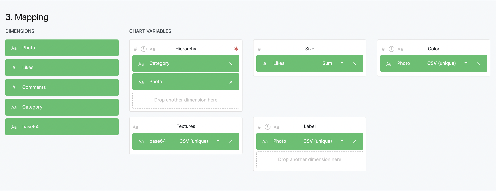
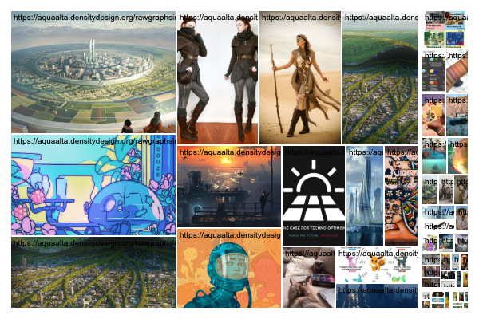
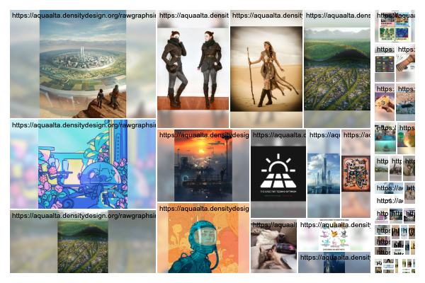

# Treemap with images
A custom model for RAWGraphs 2.0 that allows to produce treemaps with images.

Use this example [dataset](example/datasets/photos-twitter-base64.csv), with the following data mapping:

### Options

| Fill area | Preserve aspect |
| --- | --- |
|  |  |
| Each image fills the entire available area and is clipped to it | Each image preserves its aspect. The uncovered space is filled with a blurred version  |

Toggle the corresponding visual option in the chart group.

### Test the chart

The custom chart [comes as a js file](docs/images-treemap.v0.1.umd.js) that you can load into RAWGraphs. Currently is an experimental feature, use this [nightly build](https://rawcustom.sandbox.inmagik.com/) to test:

- load the dataset
- load the custom model
- map the data
- profit!

### Compile your dataset

Create a dataset with a column where images are stored as base64 strings. Similar files can consume quite a lot of storage, but will allow to preserve images even if they go offline. Such datasets can be created with a tool like [this one](https://observablehq.com/@iosonosempreio/images-table-to-base64).

| category-1  | category-2 | textures |
| ------------- | ------------- | ------------- |
| User  | Post  | "data:image/jpeg;base64,/9j/4AAQSkZJRgABA..." |

### Create your custom visual model

Fork this [template](https://github.com/gffuma/custom-rawcharts-template-test) by [@gffuma](https://github.com/gffumar).

