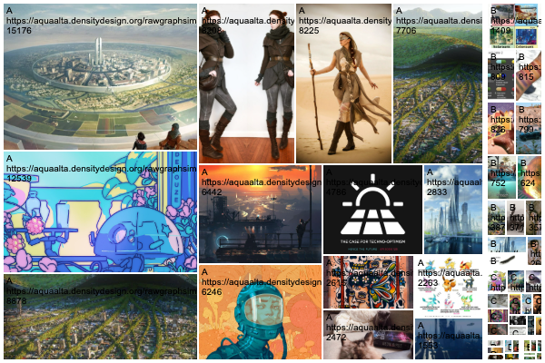
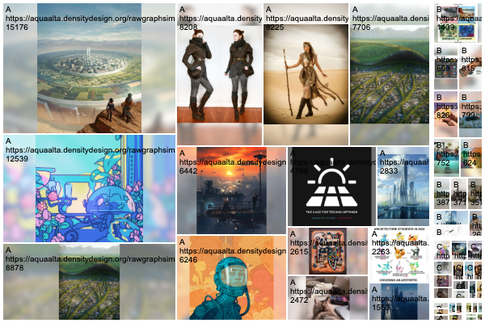
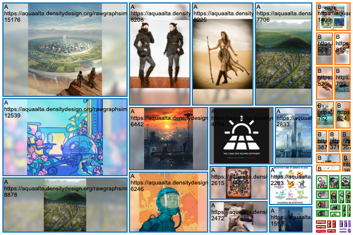
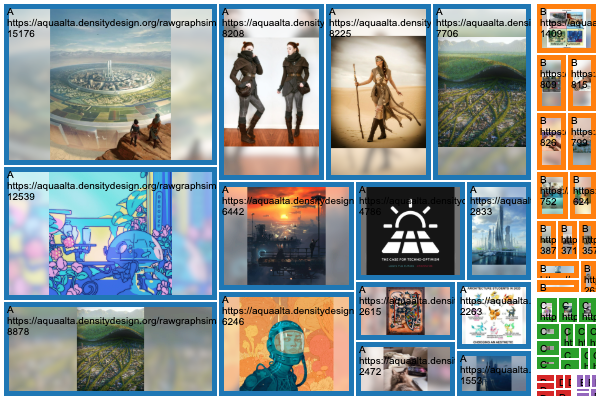
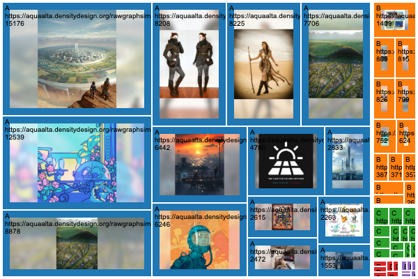

# Treemap with images
Implementation of a RAWGraphs treemap that allows the display of images. With this chart you can map *direct image urls* or *base64s* to a chart variable named *images*.

## Data
Compile a dataset with **direct URLs to pictures** or **base64 strings**. 

| URL | base64 |
| ------------- | ------------- |
| https://i.postimg.cc/50DqCFFj/solarpunk-001.jpg | data:image/jpeg;base64,/9j/4AAQSkZJRgAB... ([complete version](docs/base64-example.txt)) |

If you use URLs, consider services like [imgbb.com](https://imgbb.com/) or [postimages.org](https://postimages.org/) to safely store images online.

Expect heavy datasets files if you use base64. This approach produces more robust visualizations since images are embedded directly into the data, meaning that they are preserved even if the originals go offline. Additionally you can rework the SVG in vector editing softwares (Inkscape, Illustrator). You can encode base64s with a tool like [this one](https://observablehq.com/@iosonosempreio/images-table-to-base64).

### Data samples
- [A dataset with stable URLs to images](example/datasets/sample-photos-urls.csv)
- [A dataset with base64 encodings](example/datasets/sample-photos-base64.csv)

## Use the chart
Load [the custom chart](docs/images-treemap.latest.umd.js) into this [nightly build](https://rawcustom.sandbox.inmagik.com/).

- load the dataset
- load the custom model
- map the data
- <button>profit!</button>

## Visual options
### Fill area
| `true` | `false` |
| --- | --- |
|  |  |
| Each image fills the available area and is clipped to it, similarly to the CSS property `background-size: cover`. | Each image is contained and centered into the available area. The uncovered space is filled with a blur. |

### Stroke size
Controls the size of the stroke around images.
| value = 2 | value = 5 | value = 10 | value = 0 |
| - | - | - | - |
|  |  |  |  |

### Create your custom visual model
Fork this [template](https://github.com/gffuma/custom-rawcharts-template-test) by [@gffuma](https://github.com/gffumar).